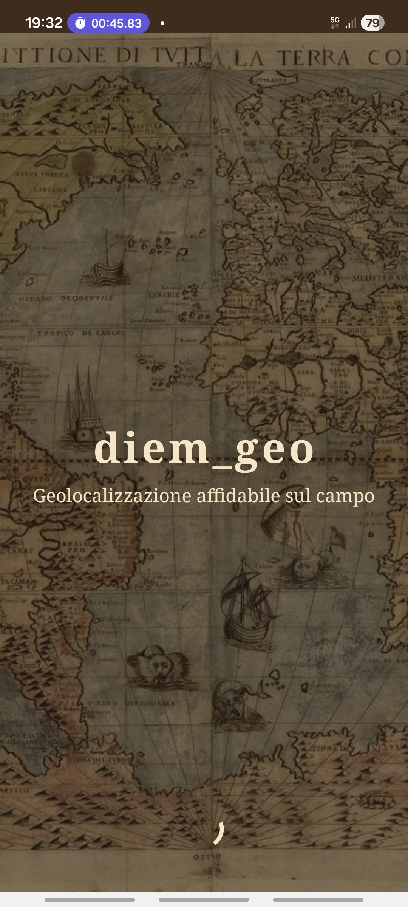
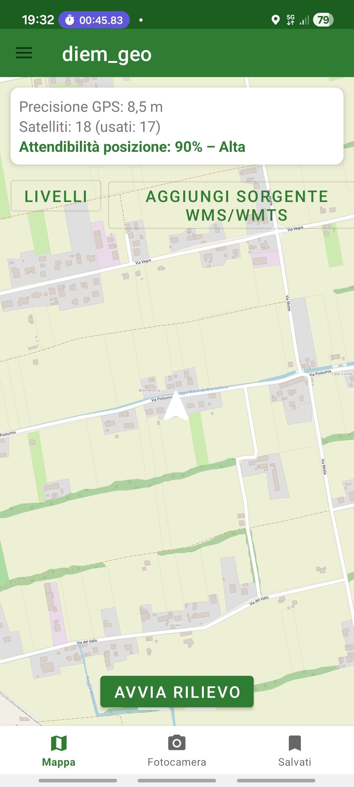
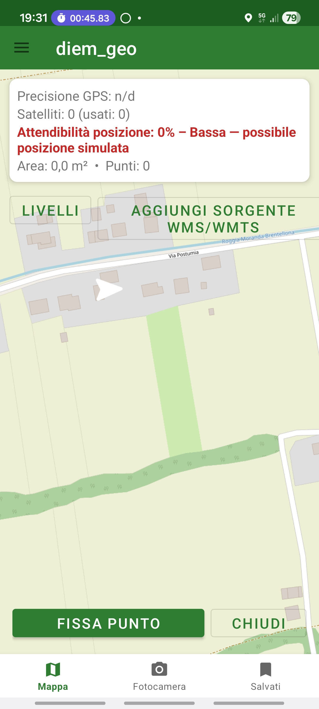

# diem_geo

App Android per la geolocalizzazione affidabile sul campo: mappe open source
(OSM/WMS/WMTS, sorgenti aggiungibili), rilievo di poligoni punto per punto,
stima dell'errore GPS e un punteggio di attendibilità della posizione
(anti-spoofing euristico, con blocco dei dispositivi rooted), scatto foto con
riconoscimento del contenuto via AI on-device, metadati completi (coordinate,
ora, angolazione della fotocamera, sensori) e una firma steganografica
nascosta nei pixel per rilevare manomissioni delle foto.

Schermata di benvenuto all'avvio e menu laterale (hamburger) con
informazioni sulla versione e manuale d'uso integrato.

## Screenshot

<table>
<tr>
<td width="33%">

<br><sub>Schermata di benvenuto</sub>
</td>
<td width="33%">

<br><sub>Mappa, precisione GPS e attendibilità della posizione</sub>
</td>
<td width="33%">

<br><sub>Rilievo poligono: Fissa punto / Chiudi</sub>
</td>
</tr>
</table>

## Build

L'APK di debug viene generato automaticamente da GitHub Actions
(`.github/workflows/android-build.yml`) ad ogni push su `main`: il workflow
compila il progetto e pubblica l'APK come artifact scaricabile dalla tab
Actions del repository.

Per compilare in locale serve JDK 17 e Android SDK (platform 34):

```
./gradlew assembleDebug
```

L'APK generato si trova in `app/build/outputs/apk/debug/`.

## Rilievo di un poligono

Il tracciamento non è più un campionamento continuo del GPS mentre si
cammina: è un rilievo punto per punto, pensato per misurare i confini di
un'area con precisione.

1. "Avvia rilievo" apre una nuova sessione.
2. Cammina fino a ogni vertice e premi "Fissa punto": puoi farlo tutte le
   volte che serve, un punto per ogni angolo del poligono (un piccolo
   margine di 0,5 m scarta solo i doppi tap accidentali sullo stesso punto).
3. "Chiudi" termina il rilievo (servono almeno 3 punti), chiede un nome e
   salva il poligono con area, accuratezza media e un file GeoJSON
   contenente i metadati di ogni singolo vertice.

## Note sull'attendibilità della posizione

Android non offre alcuna API che garantisca in modo assoluto che una
posizione GPS sia genuina. Il "punteggio di attendibilità" mostrato in app
combina più segnali (flag di mock location, numero di satelliti usati nel
fix, qualità del segnale GNSS, plausibilità dei sensori di movimento, stato
di root del dispositivo) in un indicatore euristico 0-100%, utile per
segnalare posizioni sospette ma non utilizzabile come prova legale di
autenticità.

## Protezione dai dispositivi rooted

All'avvio (`SplashActivity` + `security/RootDetector.kt`) l'app verifica la
presenza di permessi di root o di una firma di sviluppo/debug (binari `su`,
app di gestione root note come Magisk/SuperSU, tag `test-keys` di build) e,
se li trova, blocca l'accesso all'app con un messaggio esplicativo: un
dispositivo rooted rende molto più facile falsificare le coordinate GPS, che
è esattamente il rischio da cui vuole proteggere il punteggio di
attendibilità del punto precedente.

Si tratta di un controllo euristico, non di una garanzia assoluta: come
effetto collaterale, blocca anche gli emulatori e le build di sviluppo
Android (che normalmente hanno anch'esse un tag `test-keys`), il che è
voluto per questa app ma va tenuto presente se in futuro serve testarla su
un emulatore.

## Metadati della fotocamera

Oltre a coordinate, ora e dati dei sensori, ogni foto salva anche
l'angolazione della fotocamera al momento dello scatto: direzione
(azimuth, rispetto al nord magnetico) e inclinazione (pitch/roll), calcolate
da accelerometro e magnetometro. La direzione viene scritta anche nel tag
EXIF standard `GPSImgDirection`, leggibile da qualunque app che supporti i
metadati EXIF.

## Crediti

Lo sfondo della schermata di benvenuto (`app/src/main/res/drawable-nodpi/splash_map_bg.jpg`)
è la mappa del mondo del 1565 di Paolo Forlani, di pubblico dominio
(PD-old-100-expired), da Wikimedia Commons:
https://commons.wikimedia.org/wiki/File:Old-world-map.jpg
